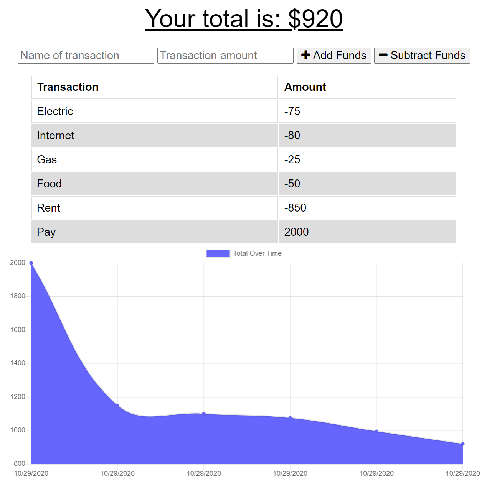

# Budget Tracker

## Table of Contents

* [General Info](#general-info)
* [Technologies](#technologies)
* [How to Use](#how-to-use)
* [Application Demo](#application-demo)
* [Application Link](#application-link)
* [License](#license)
* [Contact](#contact)

## General Info

An application that allows users to add expenses and deposits to their budget with or without a connection. When entering transactions offline, these transactions populate the total when brought back online. When online, the transctions are saved in MongoDB.

## Technologies

* HTML
* CSS
* JavaScript
* MongoDB
* Express
* Mongoose
* Morgan
* Compression
* Node

## How to Use

To run this application locally:

* Clone or download the repository
* Open the code in your preferred code editor
* Open the integrated terminal in the code editor
* Run npm install in the terminal
* Enter nodemon server.js in the terminal

After following these steps, open your preferred browser and navigate to http://localhost:3030/

## Application Demo

## Application Link

[Budget Tracker](https://budget-tracker-kasey.herokuapp.com/)

## License

## Contact

* Email: jones.m.kasey@gmail.com

* GitHub: https://github.com/joneskm72